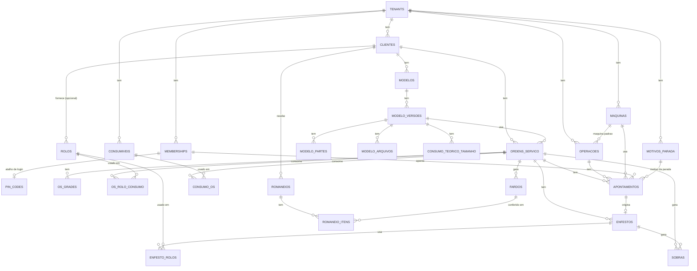

# Talharia SaaS

Gestão para talharias (corte de tecido para confecções). Multi-tenant, pt-BR, timezone America/Sao_Paulo, moeda BRL.

## Stack

Next.js 16 (App Router) · TypeScript · Tailwind v4 · shadcn/ui · Supabase (Postgres, Auth, RLS)

## Rodando localmente

```bash
npm install
npx supabase start        # sobe Postgres/Auth local via Docker
cp .env.local.example .env.local
# preencha NEXT_PUBLIC_SUPABASE_ANON_KEY com a "anon key" impressa pelo `supabase start`
npx supabase migration up # aplica as migrations em supabase/migrations
npm run dev
```

- App: http://localhost:3000
- Health check: http://localhost:3000/api/health
- Supabase Studio local: http://127.0.0.1:54323

## Multi-tenant

Toda tabela de domínio carrega `tenant_id` e tem RLS habilitado, restringindo o acesso aos tenants aos quais o usuário pertence (tabela `memberships`, papéis `OWNER`/`ADMIN`/`OPERADOR`). Ver `supabase/migrations`.

Operador (talhador) tem conta normal (`memberships` com role `OPERADOR`); o PIN de 4 dígitos (`pin_codes`) é só um atalho de login no tablet.

## Modelo de dados


